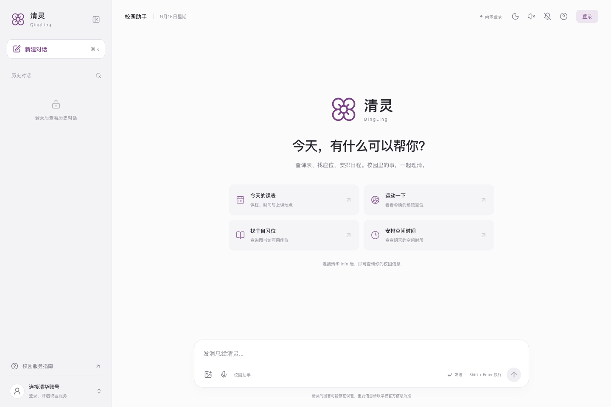
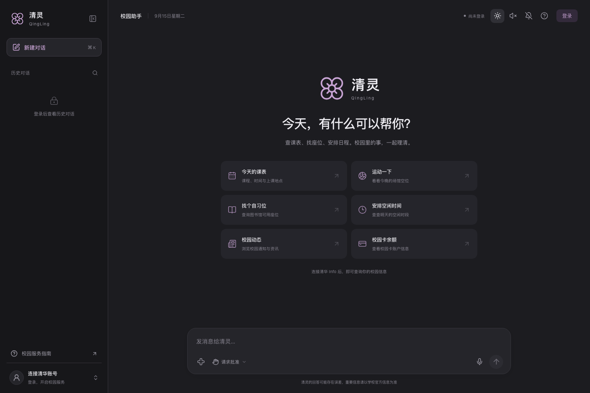
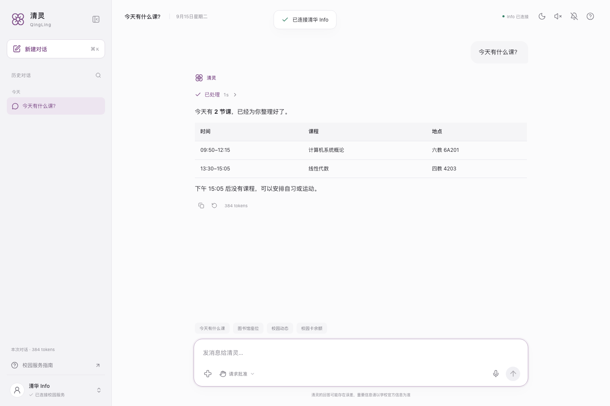
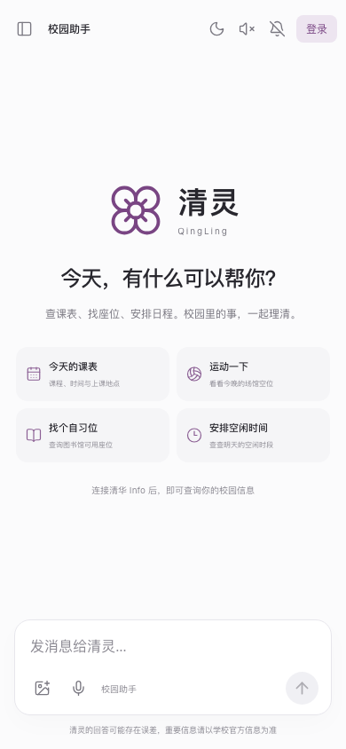
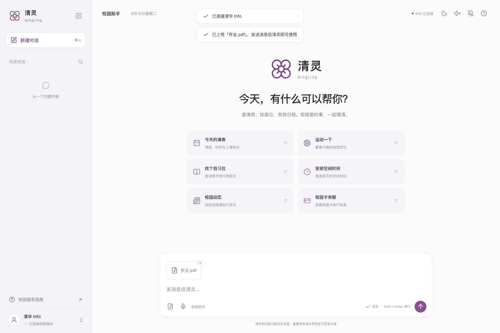
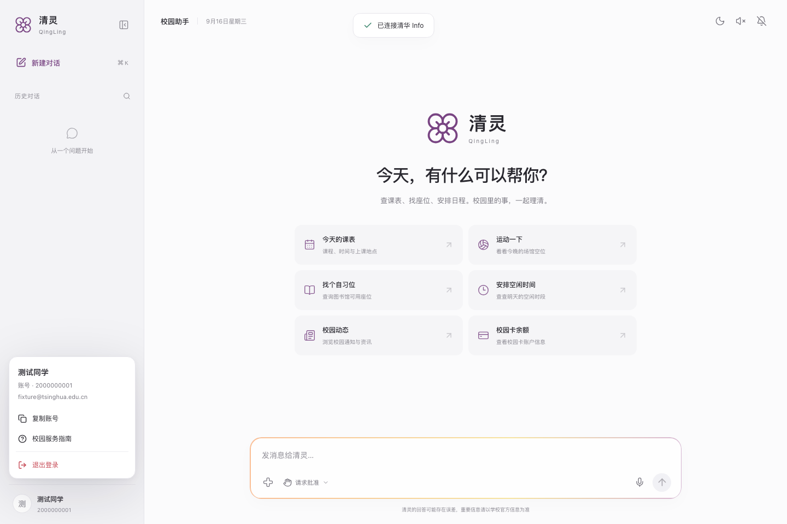
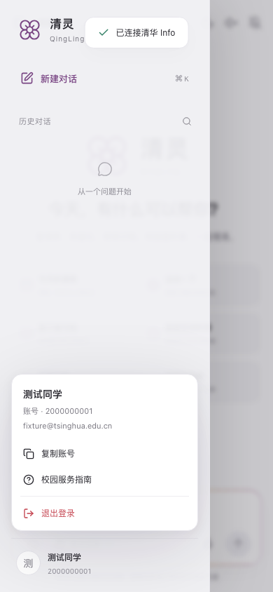
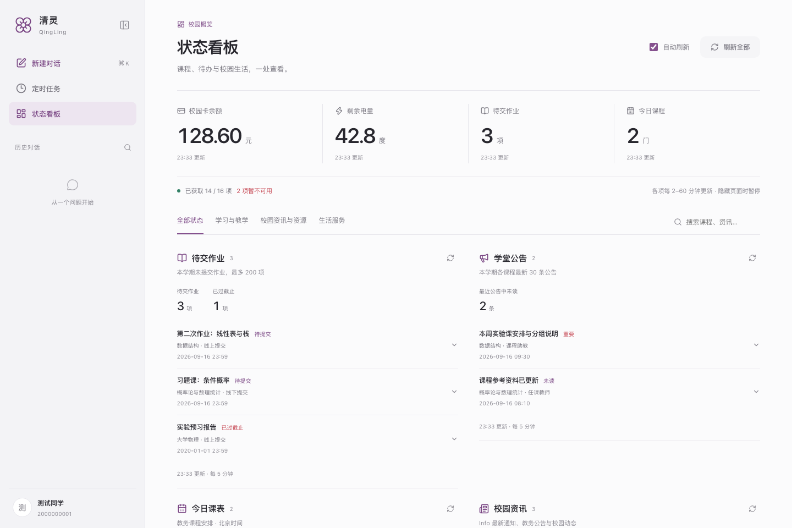
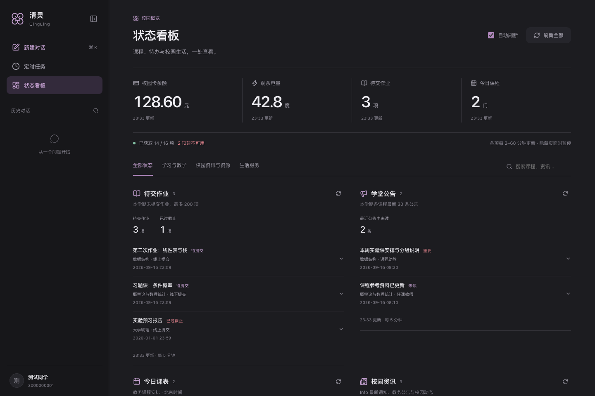
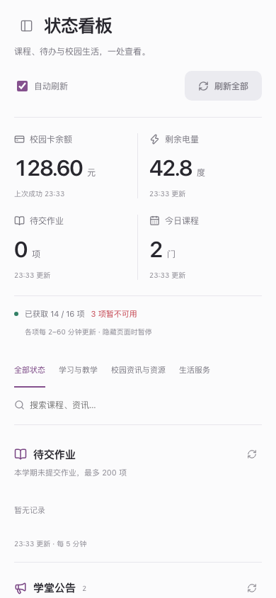

# 清灵 Web UI

前端使用 React、TypeScript、Vite、Lucide React 和 Motion。
浅色与深色共享布局、字体和间距；系统字体优先，资源本地打包。
原生 dialog 提供焦点约束与 Escape 关闭，移动侧栏支持遮罩关闭与键盘导航。
动效包含分层入场、侧栏伸缩、选中态移动、处理过程折叠、弹窗和通知过渡。

## 截图

截图由离线测试生成，课程、账号和预约均为测试数据。

### 桌面 · 浅色

### 桌面 · 深色

### 对话与课程表

### 手机

### 文件上传

### 账户菜单

点击左下角账户向上展开姓名、账号和邮箱信息，可复制账号、打开校园服务指南或选择退出。

### 状态看板

“定时任务”下方的入口打开独立看板，展示 16 类校园信息；支持分类搜索、自动／手动刷新、
公告正文、错误重试和旧数据标识。以下截图全部使用合成数据，网络和宿舍卫生故意模拟不可用状态。

## 后端数据

工作区使用 `data/qingling.sqlite` 保存对话、处理时序、图片与附件、用量、模型上下文、
账号展示信息和界面偏好。流式处理由服务端分段落库，结束或取消时立即保存。
工作区 API 使用 `no-store`，浏览器只缓存静态界面资源；原 localStorage 内容确认迁移成功后删除。
同一后台的新浏览器无需搬运浏览器数据即可继续使用历史。旧后端 JSON 上下文只迁移一次。

## 验证

`pnpm typecheck` 检查前后端 TypeScript；`pnpm test --exclude 'tests/integration/**'`
运行离线单元及服务端测试；`pnpm test:web` 启动端口 3461 的离线模拟服务并运行浏览器回归。
模拟服务复用实际 HTTP/SSE 与确认桥，但不装配真实客户端、调度器或 LLM。

浏览器覆盖数据库与全新浏览器恢复、账户菜单键盘及手机交互、历史登录隔离、流式处理状态、停止/再次发送、明确确认、二次认证、
图片和文件附件、上传失败与切换对话、临时图片查看/删除/过期、光标位置语音输入、
中文输入法、手机布局、深浅色和焦点返回。
校园服务真实登录、设备麦克风识别和真实支付仍需在实际使用环境验证。
